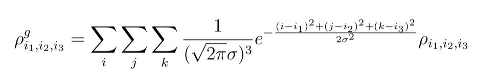
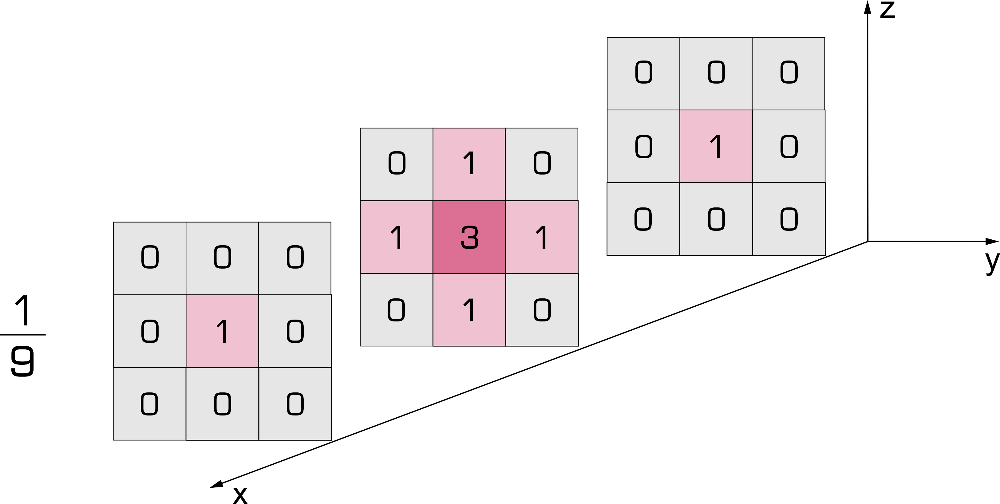
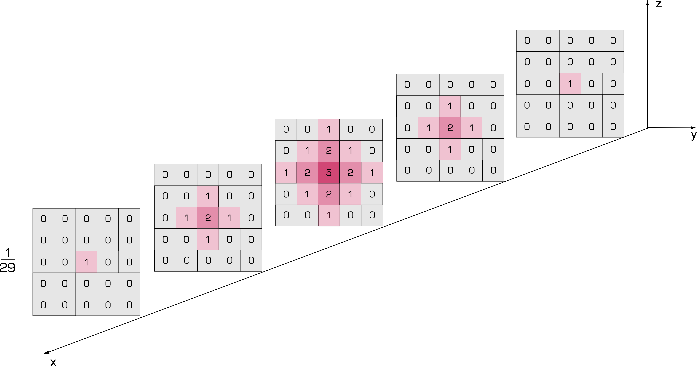
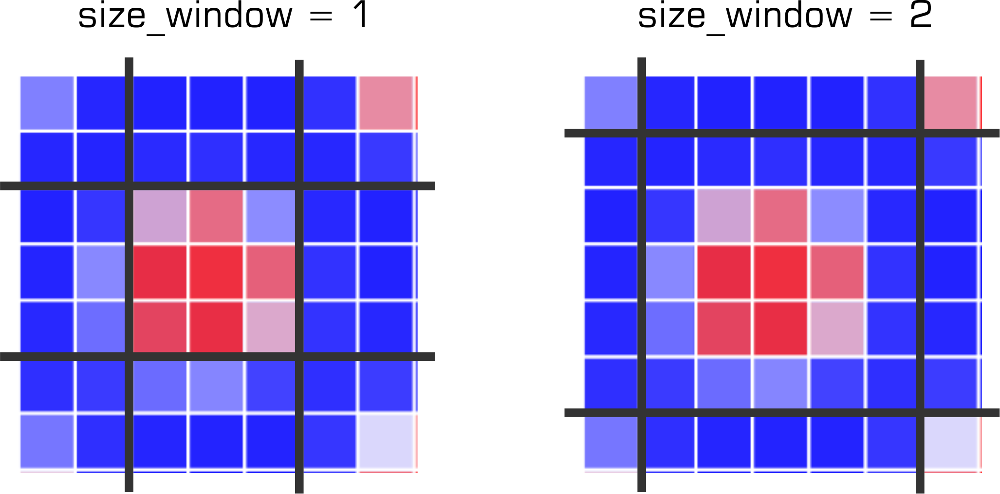
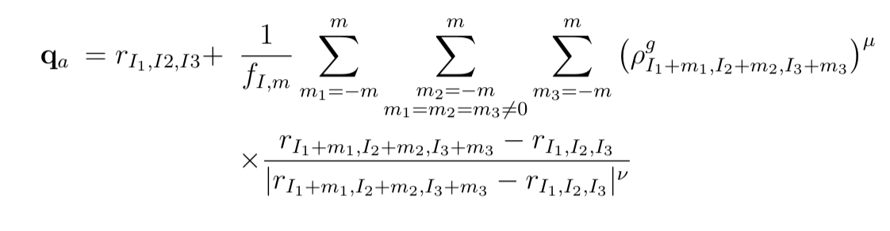
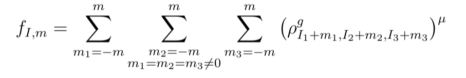
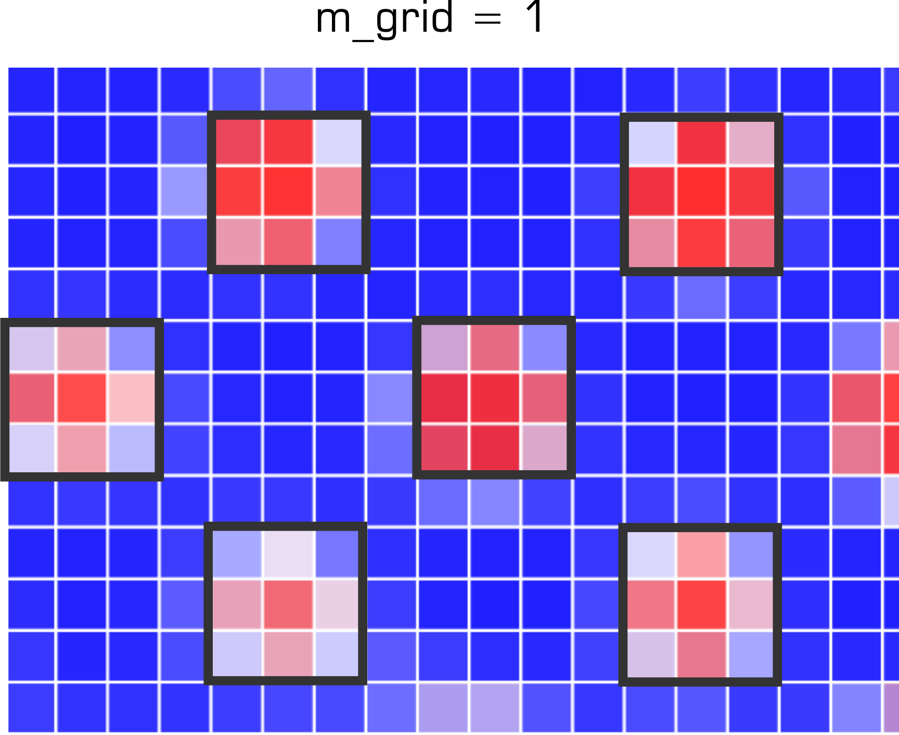

# fratons2atoms

python package to convert atomic densities ("fratons") from quasiparticle calculations [[1](https://journals.aps.org/prb/abstract/10.1103/PhysRevB.89.014111), [2](https://www.nature.com/articles/npjcompumats201513)] to Cartesian coordinates of atomic positions

**Authors:** A.M. Goryaeva, M.C. Marinica

alexandra.goryaeva (at) univ-rouen.fr

Purposes:
-----------------
Conversion of binary h5 files with atomic densities  ("fratons") to xyz coordinates that can be visualized and analyzed with [ovito](https://www.ovito.org/) and serve as an input for atomistic calculations

Description
----------------
The atomic coordinates are written from the distribution of atomic densities after applying three consecutive filters:

### Filter 1:
This filter removes numerical fluctuations in the amplitude of the initial densities (due to the numerical integration, thermal fluctuations, etc.) 

The densities ρi1,i2,i3 from the grid ri1,i2,i3 are convoluted with a Gaussian with standard deviation `sigma`: 



Then, in order to enhance and better localize the center of the atom, the convoluted densities can be further optionally corrected using a kernel `mask`, which mimics a spherical shape. The examples of the implemented `333` and `555` masks are illustrated below






### Filter 2:
This filter selects the nodes of fratons I1,2,3 that are best candidates for being identified as atoms. 

The local maxima of the atomic densities are extracted using a 3D window around a node of the simulation grid. The size of the window is controlled by the input parameter `size_window`. The real dimensions of the of the 3D window correspond to `2* size_window+1` along each side. 
The examples of such windows constructed in bcc with a0=6.5 in fraton units is provided below:




### Filter3:
This filter computes "smooth" xyz atomic coodinates (e.g., coordinates that are not necessarily locted on to the nodes of the grid) based on the nodes I1,2,3 that were identified by the Filter2. 

The xyz coordinates are obtained using a decreasing weighted average:




with the normalization factor:


The "smoothening" is controlled by the two exponents: `mu` and `nu` and by the size `m_grid` of the selected area for "smoothening"




Default parameterization of the filters:
-----------------
The default parameterization of the fileters for the most commonly used resolutions of the quasiparticle calculations:

|  Parameter    |  a0=6.5 & a0=8.0  |  a0=13.0 & a0=16.0   | 
|---------------|-------------------|----------------------|
| `sigma`       |        0.5        |         1.1          | 
|  `mask`       |        none       |         none         | 
| `size_window` |          1        |          3           | 
| `mu`          |          2.0      |          2.0         | 
| `nu`          |          1.0      |          1.0         | 
| `m_grid`      |          2        |          3           | 

Usage:
-----------------
#### Running the script with default options:

```
> python3 fratons2atoms.py --dir=<path> --a0=<a0>
```
  
With this command the script `fratons2atoms.py` will read the h5 files in the `<path>` directory and set the default parameters for the convertion based on the given `<a0>` in fraton units. In case the simulation cell contains more than one phase with different `<a0>`, the smallest one should be provided. 
  
  ##### Example: 
  
 To convert the calculations of the transition between fcc with a0=8.0 and bcc with a0=6.5 that are stored in Examples/BCC-6.5_FCC_8/ using default settings 
  
 ``` 
 > python3 fratons2atoms.py  --dir=Examples/BCC-6.5_FCC_8/  --a0=6.5
 ``` 
 
#### Running the script with custom parameters:

To convert the example provided above using different parameterization of filters, one can provide the following custom values:

- `--sigma`  standard deviation of the Gaussian in the Filter1
- `--mask`   type of the kernel mask in the Filter2. Options: 'none', '333' and '555'
- `--size_window` size of the 3D window in the Filter2
- `--mu` first exponent to compute the weighted average in the Filter3
- `--nu` second exponent to compute the weighted average in the Filter3
- `--grid_m`  size of the grid for averaging in the Filter3


  ##### Example: 
``` 
 > python3 fratons2atoms.py  --dir=Examples/BCC-6.5_FCC_8/  --a0=6.5 --mask=333 --nu=0 
 ``` 

This will add the 3x3x3 kernel mask to the Filter1 and set the exponent `nu` from the Filter3 to 0. The other input parameters will remain as in the default options.


Installation:
-----------------
To install from the terminal, use:

```
> git clone https://github.com/agoryaeva/fratons2atoms.git
```

#### Required python3 packages:

```
- numpy   (version >= 1.17.4)
- h5py    (version >= 2.10.0)
- sklearn (version >= 0.21.3)
- scipy   (version >= 1.4.1)
- numba   (version >= 0.49.1)
- natsort (version >= 7.0.1)

```


